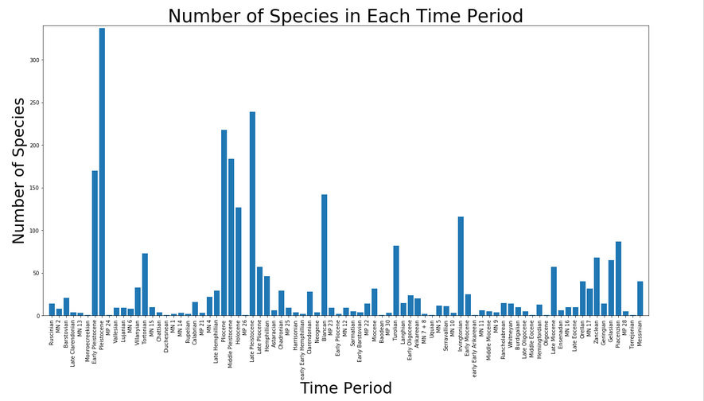
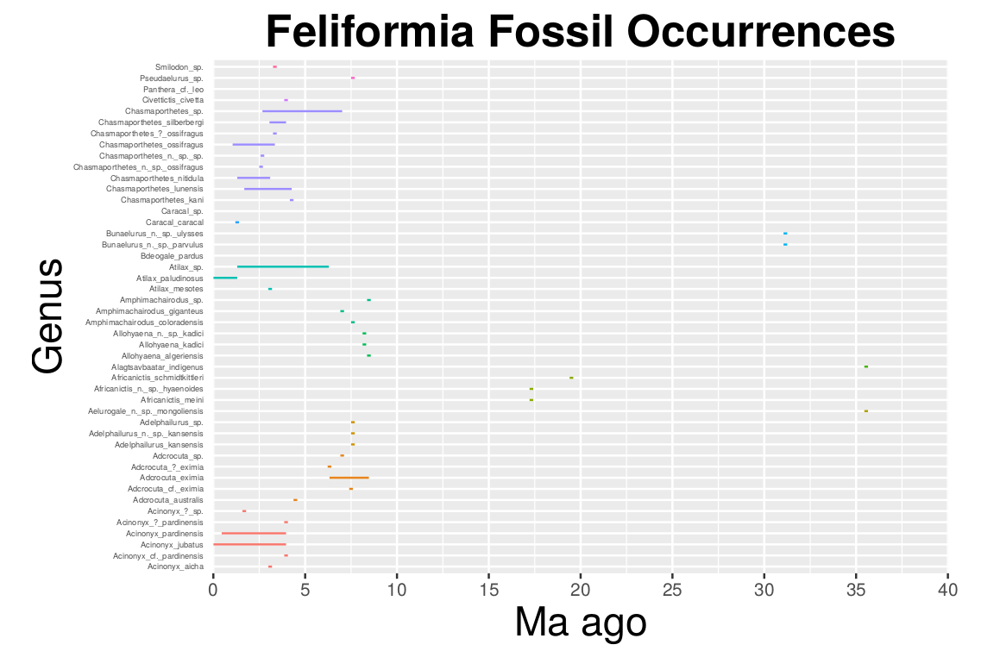
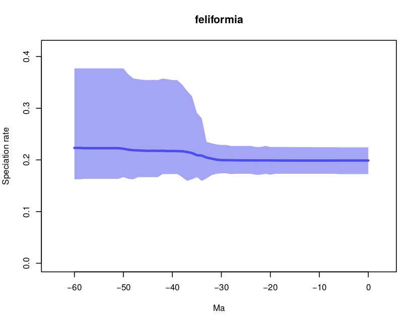
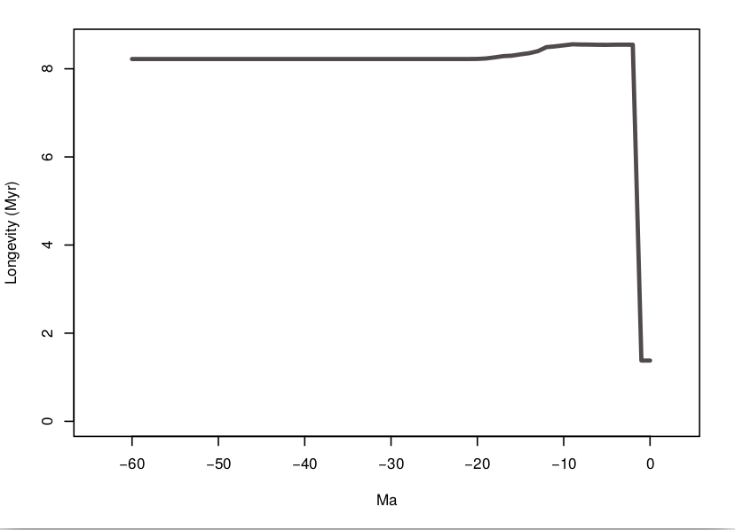

# Abstract
In the Middle Eocene time period, about 40 mya, the branch of Carnivora order began to appear and soon after came the suborder, Feliformia ("Feliformia," 2008). This suborder of cat-like species peaked in the Pleistocene time period when it contained over 300 species. Though it is normal to see fluctuation in number of species across millions of years, we know that some of the most well known Feliformia species, such as the saber-toothed cat, is now extinct. We wonder if other species are soon to follow in these footsteps. With the manipulation of data downloaded from The Paleobiology Database (PBDB), we allow users to quickly draw information on Feliformia species and use the data to visually see Feliformia trends over time. We show that restoration and prevention of specie extinction is important if we want to stop and reverse the declining specie diversity of the Feliformia suborder.

# Introduction

The Carnivora order is divided into the suborders Feliformia (cat-like) and Caniformia (dog-like) suborders. Feliformia includes felids (true cats), hyenas, mongooses, civets, and related taxa, while the Caniformia contains includes "dog-like" carnivores such as dogs, wolves, bears, weasels, and skunks (Sussle).

Carnivora are unique from other mammals in that they have four carnassial teeth in the front of the jaw. These upper and lower pairs of teeth (molars or premolars) help self-sharpening edges to pass by each other to create a shearing manner. Feliforms are unique from Caniformia in that they have double chambered auditory bullae, which is a portion of the skull that encloses the auditory region ("Feliformia," 2008). 

The Feliforms began mainly as forest-dwelling, ambush hunters at the time. Some of the most specialized and well-known species were the saber-tooths. Most species can be found in a wide range of environments, but some have adapted to a limited range of habitats like the sand cats (Etnyre et. al). Molecular phylogenies suggest that all extant Feliformia are monophyletic, meaning it contains ancestral species and all its descendants (Sussle). Though many species have gone extinct, there are still many species that continue to evolve. 


# Methods
Using the data downloaded from The Paleobiology Database website, the csv file was then manipulated through four different Functions to provide information for users (an example for the first three functions are provided).

## Python Functions 

**Function 1: **Choose a species and find out its time period!
```{python, eval=F}
import csv
file = open("/home/eeb177-student/Desktop/eeb-177/eeb-174-final-project/
new.feliformia.csv")

#read csv and remove commas / delimiters (characters that separate text strings)  
readCSV = csv.reader(file, delimiter=',')

def Feliformia (identifier):
    i = 0  #counter / identifier for which row we are on
    era = None #assign default value, and when era = None then 
    #-identifier does not exist 
    for row in readCSV:
        if( len(row) < 13 ): #want to check if there are at least 12
        #-columns per row or else skip
            continue
        if( row[5] == identifier ): #check if column 6 is the same 
        #-value as the identifier
            era = row[12] #overwrites era with column 13 value
            break

    if( era == None ): #checks if "era" is equal to None, so 
    #-identifier doesn't exist, so print string below 
        print( "Please enter a valid species" )
    return era
```
***Example***
```{python, eval=F}
Feliformia("Viverrinae indet.")
```
Out[1]:'Turolian'

\vspace{1cm}

**Function 2: ** Choose a time period to discover how many species and which species are found in that time period!

```{python, eval=F}
import csv
file = open("/home/eeb177-student/Desktop/eeb-177/eeb-174-final-project/
feliformia.csv")
readCSV = csv.reader(file, delimiter=',')

ListOfSpecies = [] #create empty list

def Feliformia (TimePeriod):
    i = 0
    identifier = None
    for row in readCSV:
        if( len(row) < 12 ):
            continue
        if (row[12] == TimePeriod):
            identifier = row[5]
            ListOfSpecies.append(identifier) #add or append identifier to list
            continue
```

***Example***

```{python, eval=F}
Feliformia("Turolian")

str1 = ' , '.join(ListOfSpecies) #gives every element/species from list, 
#-separated by a " , " 
print ("This Time Period includes " + str(len(ListOfSpecies)) + 
" species, which are: " + str1)
```
Out[2]:'This Time Period includes 83 species, which are: Ictitherium gaudryi , Viverrinae indet. , Machairodus fires , Metailurus sp. , Machairodus ex gr. gigantheus , Ictitherium sp. , Ictitherium cf. sinence , Adcrocuta eximia , Hyaenictitherium hyaenoides , Machairodus kurteni , Hyaena sp. , Felidae indet. , Ictitherium sp. , Felis christoli , Dinofelis sp. , Amphimachairodus giganteus , Paramachairodus ? maximiliani , Thalassictis aff. hyaenoides , Metailurus parvulus , Machairodus giganteus , Adcrocuta eximia , Thalassictis adroveri , Plioviverrops guerini , Lycyaena sp. , Viverra sp. , Ictitherium sp. , Felis sp. , Ictitherium hipparionum , Adcrocuta eximia , Machairodus sp. , Ictitherium hipparionum , Adcrocuta eximia , Metailurus major , Machairodus sp. , Ictitherium hipparionum , Hyaenictis eximia , Paradoxurinae indet. , Viverridae ? indet. , Ictitherium gaudryi , Viverrinae indet. , Ictitherium gaudryi , Epimachairodus fires , Pseudaelurus sp. , Viverra sp. , Paradoxurinae indet. , Viverridae indet. , Ictitherium gaudryi , Ictitherium sp. , Epimachairodus fires , Pseudaelurus sp. , Viverrinae indet. , Ictitherium gaudryi , Pseudaelurus sp. , Viverra sp. , Viverrinae indet. , Viverridae indet. , Ictitherium gaudryi , Pseudaelurus sp. , Felis sp. , Paradoxurinae indet. , Viverridae indet. , Ictitherium gaudryi , Ictitherium sp. , Epimachairodus fires , Pseudaelurus sp. , Felis attica , Paramachairodus sp. , Machairodus sp. , Adcrocuta eximia , Felis sp. , Dinofelis sp. , Adcrocuta sp. , Ictitherium (Ictitherium) sp. , Ictitherium (Palhyaena) sp. , Machairodus giganteus , Felis attica , Paramachairodus orientalis , Adcrocuta eximia , Adcrocuta eximia , Plioviverrops sp. , cf. Metailurus parvulus , Viverridae indet. , Chasmaporthetes sp.'

\vspace{1cm}

**Function 3: ** See how many unique species are in each time period!
```{python, eval=F}
def Feliformia():
    FeliformiaCSV= open("/home/eeb177-student/Desktop/eeb-177/eeb-174-final-project/
    feliformia.csv", "r", encoding = "ISO-8859-1")
    alldata=FeliformiaCSV.readlines() [19:] #include lines 19 and after
    
    Timeperiod_dict = {} #empty dictionary
    
    for line in alldata:
        record_elements = line.split(",") #remove commas / delimiters
        if len(record_elements) < 12:
            continue
        Timeperiod = record_elements[12] #timeperiod assigned as column 13 values
        if Timeperiod in Timeperiod_dict: #search dictionary for time period 
            count = Timeperiod_dict[Timeperiod] #extract count value for the 
            #-time period
            Timeperiod_dict[Timeperiod] = count + 1 #add one to the count value
        else: 
            Timeperiod_dict[Timeperiod] = 1 #when time period is new assign 
            #-value of 1           
    return Timeperiod_dict
```

***Example***

```{python, eval=F}
print (Feliformia())
```
Out[3]:{'Ruscinian': 14, 'MN 2': 8, 'Barstovian': 21, 'Late Clarendonian': 4, 'MN 13': 3, 'Monroecreekian': 1, 'Early Pleistocene': 170, 'Pleistocene': 337, 'MP 24': 1, 'Vallesian': 9, 'Lujanian': 9, 'MN 6': 8, 'Villanyian': 33, 'Tortonian': 73, 'MN 15': 10, 'Chattian': 4, 'Duchesnean': 1, 'MN 1': 2, 'MN 14': 3, 'Rupelian': 2, 'Calabrian': 16, 'MP 21': 3, 'MN 4': 22, 'Late Hemphillian': 29, 'Pliocene': 218, 'Middle Pleistocene': 184, 'Holocene': 127, 'MP 26': 1, 'Late Pleistocene': 239, 'Late Pliocene': 57, 'Hemphillian': 46, 'Astaracian': 6, 'Chadronian': 29, 'MP 25': 9, 'Harrisonian': 4, 'early Early Hemphillian': 2, 'Clarendonian': 28, 'Neogene': 4, 'Blancan': 142, 'MP 23': 9, 'Early Pliocene': 2, 'MN 12': 9, 'Sarmatian': 5, 'Early Barstovian': 4, 'MP 22': 14, 'Miocene': 32, 'Baodean': 1, 'MP 30': 3, 'Turolian': 82, 'Langhian': 15, 'Early Oligocene': 24, 'Arikareean': 20, 'MN 7 + 8': 2, 'Uquian': 1, 'MN 5': 12, 'Serravallian': 11, 'MN 10': 3, 'Irvingtonian': 116, 'Early Miocene': 25, 'early Early Arikareean': 1, 'MN 11': 6, 'Middle Miocene': 5, 'MN 9': 4, 'Rancholabrean': 15, 'Whitneyan': 14, 'Burdigalian': 10, 'Late Oligocene': 5, 'Middle Eocene': 1, 'Hemingfordian': 13, 'Oligocene': 1, 'Late Miocene': 57, 'Ensenadan': 6, 'MN 16': 10, 'Late Eocene': 10, 'Orellan': 40, 'MN 17': 32, 'Zanclean': 68, 'Geringian': 14, 'Gelasian': 65, 'Piacenzian': 87, 'MP 28': 5, 'Torrejonian': 1, 'Messinian': 40}

\vspace{1cm}

**Function 4** Use ***Function 3*** to create a species graph!
```{python, eval=F}
import matplotlib.pyplot as plot
plot.figure(figsize=(21,10))
plot.bar(range(len(Feliformia())), Feliformia().values(), align='center')
plot.xticks(range(len(Feliformia())), list(Feliformia().keys()), rotation = 'vertical')
plot.margins(0.01)
plot.subplots_adjust(bottom=0.1)
plot.title('Number of Species in Each Time Period', fontsize = 35)
plot.xlabel('Time Period', fontsize = 30)
plot.ylabel('Number of Species', fontsize = 30)

plot.show()
```


##RStudio preparation (using jupyter notebook / python)
**(1)Setting up Fossil Occurrence Graph**

First clean file in terminal
```{r, eval = F}
tail -n +18 feliformia.csv > cleanfeliformia.csv
```
Then use python:
```{python, eval=F}
in_file = '/home/eeb177-student/Desktop/eeb-177/eeb-174-final-project/
cleanfeliformia.csv'

with open(in_file, "r") as ff:
    feliformia_recs = ff.readlines()[1:]
```

```{python, eval=F}
def sort_feliformia_name(data):
    return(data.split(",")[5])
    
feliformia_sort_csv = sorted(feliformia_recs, key = sort_feliformia_name)   

output_file = open("sorted_feliformia.csv", "w")
for entry in feliformia_sort_csv:
    output_file.write(entry)
    
output_file.close()
```

```{python, eval=F}
def feliformia_dict(csv):
    from collections import defaultdict
    
    with open(csv, "r") as zz:
        
        feliformia_data = zz.readlines()
    
    species_ranges = defaultdict(list)

    i = 0 #counter / identifier for which row we are on, this case starting with 0
    for line in feliformia_data:
        #if i > 135: #this method was to check where the error was occurring
        #    break
        if i == 136:
            continue
        if i == 1593: #unknown float error in code at this row so bypassing it  
            continue
        line = line.replace('"', '')
        species = line.split(",")[5]
        if len(species.split(" ")) > 1:
            minage = float(line.split(',')[14])
            maxage = float(line.split(',')[15])
            meanage = (minage + maxage) / 2
            species_ranges[species].append(meanage) 
        i += 1 #adds 1 to i each time it is processed
    return species_ranges
```

```{python, eval=F}
feliformia_new_dict = feliformia_dict("sorted_feliformia.csv")
```

```{python, eval=F}
def feliformia_summary(dictionary, outputfile):
    output = open(str(outputfile), "w")
    for key in sorted(dictionary.keys()): 
        ages = dictionary[key]
        maxage = max(ages)
        minage = min(ages)
        genus = key.split(" ")[0] 
        species =key.replace(" ", "_")  
        outline = "{},{},{},{}\n".format(genus, species, minage, maxage)
        output.write(outline)
    output.close()
```

```{python, eval=F}
feliformia_summary(feliformia_new_dict, "feliformia-ranges.csv")
```

\vspace{1cm}

**(2)Setting up Pyrate (locating extant species)**
```{python, eval=F}
import csv
file = open("/home/eeb177-student/Desktop/eeb-177/eeb-174-final-project/
pyrate_feliformia/feliformia_occ.csv")
readCSV = csv.reader(file, delimiter=',')

ListOfExtantSpecies = [] #create empty list

def Feliformia (TimeZero):
    i = 0
    identifier = None
    for row in readCSV:
        #if( len(row) < 12 ):
         #   continue
        if (row[11] == TimeZero):
            identifier = row[5]
            ListOfExtantSpecies.append(identifier) #add or append identifier to list
            continue
```

```{python, eval=F}
#print all the extant species BUT there are some repeats
Feliformia("0")
str1 = '" , "'.join(ListOfExtantSpecies) 
#gives every element/species from list, separated by a " , " 
print ("\"" + str1 + "\"")
```

```{python, eval=F}
#using list 1, create a list 2 that contains ONLY species mentioned once
char_list = ["Panthera leo" , "Crocuta" , "Panthera tigris" , "Leopardus pardalis" 
, "Puma yagouaroundi" , "Puma concolor" , "Panthera onca" , "Leopardus pardalis" 
, "Puma yagouaroundi" , "Puma concolor" , "Panthera onca" , "Crocuta crocuta" 
, "Panthera leo" , "Panthera pardus" , "Felis libyca" , "Hyaena hyaena" 
, "Caracal caracal" , "Ichneumia albicauda" , "Genetta genetta" , "Civettictis civetta" 
, "Acinonyx jubatus" , "Caracal serval" , "Genetta tigrina" , "Mungos mungo" 
, "Leopardus pardalis" , "Leopardus wiedii" , "Puma yagouaroundi" , "Puma concolor" 
, "Panthera onca" , "Panthera leo" , "Panthera pardus" , "Felis libyca" 
, "Ichneumia albicauda" , "Genetta genetta" , "Herpestes sanguineus" , "Proteles" 
, "Parahyaena brunnea" , "Cynictis penicillata" , "Genetta tigrina" , "Mungos mungo" 
, "Atilax paludinosus" , "Panthera leo" , "Panthera pardus" , "Hyaena hyaena" 
, "Felis silvestris" , "Panthera pardus" , "Felis silvestris" , "Felis" 
, "Crocuta crocuta" , "Panthera pardus" , "Felis silvestris" , "Felis" , "Felidae" 
, "Panthera leo" , "Hyaena hyaena" , "Felis libyca" , "Felis libyca" , "Felidae" 
, "Caracal caracal" , "Caracal serval" , "Caracal caracal" , "Caracal serval" 
, "Crocuta" , "Hyaena hyaena" , "Genetta" , "Cynictis penicillata" 
, "Herpestes ichneumon" , "Atilax paludinosus" , "Caracal caracal" 
, "Cynictis penicillata" , "Caracal caracal" , "Cynictis penicillata" 
, "Felis silvestris" , "Felis libyca" , "Panthera leo" , "Herpestes sanguineus" 
, "Crocuta crocuta" , "Herpestes sanguineus" , "Felis libyca" 
, "Felis silvestris" , "Cynictis penicillata" , "Cynictis penicillata"
, "Cynictis penicillata" , "Panthera pardus" , "Cynictis penicillata"
, "Herpestes ichneumon" , "Caracal caracal" , "Genetta genetta" , "Panthera pardus" 
, "Genetta" , "Felis libyca" , "Caracal caracal" , "Genetta genetta" 
, "Herpestes pulverulentus" , "Panthera pardus" , "Felis libyca" , "Caracal caracal" 
, "Cynictis penicillata" , "Panthera pardus" , "Cynictis penicillata" 
, "Cynictis penicillata" , "Atilax paludinosus" , "Felis libyca" 
, "Cynictis penicillata" , "Panthera pardus" , "Felis libyca" 
, "Caracal caracal" , "Genetta" , "Herpestes ichneumon" 
, "Herpestes pulverulentus" , "Panthera pardus" , "Felis libyca" 
, "Herpestes pulverulentus" , "Panthera leo" , "Felis libyca" 
, "Caracal caracal" , "Herpestes pulverulentus" , "Panthera pardus" 
, "Felis libyca" , "Caracal caracal" , "Parahyaena brunnea" 
, "Herpestes ichneumon" , "Atilax paludinosus" , "Herpestes pulverulentus" 
, "Crocuta crocuta" , "Felis libyca" , "Hyaena hyaena" , "Genetta" , "Viverridae" 
, "Felidae" , "Herpestes sanguineus" , "Genetta" , "Viverridae" , "Felis silvestris" 
, "Viverridae" , "Panthera pardus" , "Caracal caracal" , "Herpestes ichneumon" 
, "Herpestes pulverulentus" , "Crocuta crocuta" , "Felis libyca" , "Genetta genetta" 
, "Mungos mungo" , "Herpestes ichneumon" , "Panthera pardus" , "Herpestes sanguineus" 
, "Parahyaena brunnea" , "Crocuta crocuta" , "Panthera pardus" , "Felis libyca" 
, "Genetta" , "Parahyaena brunnea" , "Herpestes" , "Panthera leo" 
, "Parahyaena brunnea" , "Hyaena hyaena" , "Genetta" 
, "Felis silvestris" , "Viverridae" , "Panthera leo" , "Felis" 
, "Panthera leo" , "Civettictis civetta" , "Crossarchus" , "Viverridae" 
, "Bdeogale" , "Panthera pardus" , "Caracal serval" , "Atilax paludinosus" 
, "Viverridae" , "Puma concolor" , "Crocuta" , "Paguma larvata" , "Felis" 
, "Panthera pardus" , "Lynx rufus" , "Smilodon fatalis" , "Puma concolor" 
, "Lynx rufus" , "Leopardus pardalis" , "Leopardus" , "Puma yagouaroundi" 
, "Puma concolor" , "Smilodon populator" , "Puma" , "Lynx rufus" 
, "Felis" , "Herpestidae" , "Fossa fossana" , "Cryptoprocta ferox" 
, "Smilodon populator" , "Smilodon populator" , "Panthera onca" 
, "Lynx rufus" , "Smilodon fatalis" , "Puma concolor" , "Lynx rufus" 
, "Leopardus wiedii" , "Leopardus wiedii" , "Leopardus wiedii" , "Lynx rufus" 
, "Puma concolor" , "Herpestes ichneumon" , "Herpestes pulverulentus" 
, "Atilax paludinosus" , "Felis libyca" , "Felis" , "Panthera pardus" 
, "Panthera leo atrox" , "Lynx" , "Puma concolor" , "Lynx rufus" 
, "Panthera leo atrox" , "Hyaena" , "Felis" , "Viverridae" 
, "Suricata" , "Parahyaena brunnea" , "Crocuta crocuta" , "Panthera leo" 
, "Megantereon" , "Viverra" , "Leopardus pardalis" , "Smilodon populator" 
, "Leopardus pardalis" , "Puma concolor" , "Panthera onca" , "Smilodon populator" 
, "Panthera onca" , "Panthera onca" , "Leopardus braccatus" 
, "Panthera onca" , "Smilodon populator" , "Panthera onca" 
, "Leopardus tigrinus" , "Smilodon populator" , "Smilodon populator" , "Puma concolor" 
, "Felis" , "Felis" , "Felis silvestris" , "Lynx lynx" , "Cryptoprocta"]

chars = []

for i in char_list:
    if i not in chars:
        chars.append(i)
chars.sort()

print (chars)
```

Out[4]:['Acinonyx jubatus', 'Atilax paludinosus', 'Bdeogale', 'Caracal caracal', 'Caracal serval', 'Civettictis civetta', 'Crocuta', 'Crocuta crocuta', 'Crossarchus', 'Cryptoprocta', 'Cryptoprocta ferox', 'Cynictis penicillata', 'Felidae', 'Felis', 'Felis libyca', 'Felis silvestris', 'Fossa fossana', 'Genetta', 'Genetta genetta', 'Genetta tigrina', 'Herpestes', 'Herpestes ichneumon', 'Herpestes pulverulentus', 'Herpestes sanguineus', 'Herpestidae', 'Hyaena', 'Hyaena hyaena', 'Ichneumia albicauda', 'Leopardus', 'Leopardus braccatus', 'Leopardus pardalis', 'Leopardus tigrinus', 'Leopardus wiedii', 'Lynx', 'Lynx lynx', 'Lynx rufus', 'Megantereon', 'Mungos mungo', 'Paguma larvata', 'Panthera leo', 'Panthera leo atrox', 'Panthera onca', 'Panthera pardus', 'Panthera tigris', 'Parahyaena brunnea', 'Proteles', 'Puma', 'Puma concolor', 'Puma yagouaroundi', 'Smilodon fatalis', 'Smilodon populator', 'Suricata', 'Viverra', 'Viverridae']

\clearpage

## Using RStudio
**(1)Fossil Occurrence Graph**


```{r, eval=F}
library(ggplot2)

setwd("/home/eeb177-student/Desktop/eeb-177/eeb-174-final-project/
Creating PDF Final Paper/")

feliformia <- read.csv("feliformia-ranges.csv", header =F, as.is = T)

names(feliformia) <- c("genus", "species", "minage", "maxage")
head(feliformia)

#create forloop to make points on graph noticeable
for (i in 1:nrow(feliformia)){
if(feliformia$minage[i] == feliformia$maxage[i]){
 feliformia$minage[i] <- feliformia$minage[i] - .1
  feliformia$maxage[i] <- feliformia$maxage[i] + .1
}
}

abs(feliformia$maxage -feliformia$minage)

feliformia_occ <- ggplot(feliformia, aes( species, ymin = maxage, ymax=minage
, colour = genus))
feliformia_occ <- feliformia_occ + geom_linerange()
feliformia_occ <- feliformia_occ + theme(legend.position="none") #removes legend
feliformia_occ <- feliformia_occ + coord_flip() #flips axis/graph
feliformia_occ <- feliformia_occ +  theme(axis.text.y = element_text(size=4)) 
#larger text size
feliformia_occ <- feliformia_occ + theme(axis.ticks.y=element_blank())
#removes tick marks
feliformia_occ <- feliformia_occ + scale_y_continuous(limits=c(0, 40)
, expand = c(0, 0), breaks=c(0, 5, 10, 15, 20, 25, 30, 35, 40)) 
#removes white space on graphs
feliformia_occ <- feliformia_occ + labs(title = "Feliformia Fossil Occurrences"
, x = "Genus", y = "Ma ago") + theme(plot.title = element_text(hjust = 0.5
, size=22, face = "bold"), axis.title =element_text(size=20))
#adds title/labels

feliformia_occ 

feliformia_occ <- feliformia_occ + theme(axis.title.x = element_text(margin(r=10)))
```
\clearpage

**(2)Using Pyrate**
```{r, eval=F}
source("~/PyRate/pyrate_utilities.r")

# we need to give the utilities a list of extant species
extant_feliformia = c("Acinonyx jubatus", 'Atilax paludinosus', 'Bdeogale'
, 'Caracal caracal', 'Caracal serval', 'Civettictis civetta', 'Crocuta'
, 'Crocuta crocuta', 'Crossarchus', 'Cryptoprocta', 'Cryptoprocta ferox'
, 'Cynictis penicillata', 'Felidae', 'Felis', 'Felis libyca', 'Felis silvestris'
, 'Fossa fossana', 'Genetta', 'Genetta genetta', 'Genetta tigrina', 'Herpestes'
, 'Herpestes ichneumon', 'Herpestes pulverulentus', 'Herpestes sanguineus'
, 'Herpestidae', 'Hyaena', 'Hyaena hyaena', 'Ichneumia albicauda', 'Leopardus'
, 'Leopardus braccatus', 'Leopardus pardalis', 'Leopardus tigrinus'
, 'Leopardus wiedii', 'Lynx', 'Lynx lynx', 'Lynx rufus', 'Megantereon'
, 'Mungos mungo', 'Paguma larvata', 'Panthera leo', 'Panthera leo atrox'
, 'Panthera onca', 'Panthera pardus', 'Panthera tigris', 'Parahyaena brunnea'
, 'Proteles', 'Puma', 'Puma concolor', 'Puma yagouaroundi', 'Smilodon fatalis'
, 'Smilodon populator', 'Suricata', 'Viverra', 'Viverridae')
                      
extract.ages.pbdb(file="feliformia_occ.csv",extant_species=extant_feliformia)
```

\vspace{1.5cm}

***Running Pyrate in Terminal:*** 
```{python, eval=F}
python ~/PyRate/PyRate.py canid_occ_PyRate.py -n 1000000
```

\clearpage

# Results

\vspace{.5cm}
##Python Functions: Function 4
Pulled from **Function 4**, this graph shows all the time periods and the number of species in each time period. The graph shows that species fluctuated with richness containing over 300 species to periods where there were almost zero species remaining.

\vspace{1.5cm}



\clearpage

\vspace{.5cm}

## Using RStudio: (1)Fossil Occurrence Graph


Pulled from **Using RStudio (1)**, this is the Fossil Occurrence Graph with genus over time. The graph allows one to see the different genuses and see the time ranges when these genuses were present.

\vspace{1.5cm}




\clearpage

## Using RStudio: (2)Using Pyrate
Pulled from **Using RStudio (2)**, the next four figures were created using Pyrate. The images include speciation rate, extinction rate, net diversity, and longevity, after running one million MCMC iterations.

\vspace{1.5cm}



\clearpage

\begin{figure}[t]
\label{fig:pop}
\includegraphics[width=14cm, height=14cm,keepaspectratio]{extinction-rate.png}
\centering
\caption{Extinction Rate of Feliformia}
\end{figure}

\vspace{2cm}

\begin{figure}[t]
\label{fig:pop}
\includegraphics[width=14cm, height=14cm,keepaspectratio]{Net-Diversification-Rate.png}
\centering
\caption{Net Diversification Rate of Feliformia}
\end{figure}

\clearpage



\vspace{.2cm}

# Conclusion
Studying *Figure 2*, the suborder Feliformia was flourishing with over 300 species in the Pleistocene time period. In fact, the top 3 time periods with the most number of species came from Pleistocene, Late Pleistocene, and Pliocene (which comes directly after Late Pleistocene). However, *Figure 2* also showed specie numbers where extinction of the whole suborder looked plausible. As seen in *Figure 3*, the popular saber-toothed cats in the Smilodon genus, arose and became extinct quickly like some other Feliformia genuses. Similarly, *Figure 4* and *Figure 5*, shows that speciation rate maintained constant despite extinction rate sharply increasing in the recent 3-4 million years. The sharp increase in *Figure 5* correlates with the sharp drop in net diversity seen in *Figure 6*. If we plan to prevent popular species from becoming extinct, like the extinct saber-toothed cats, humans should look to focus on conservation methods to maintain current extant species. Because the speciation rate trend has remained constant over the years, if we are able to slow and minimize the extinction rate, there may be a positive net diversity in the future if enough awareness and efforts are put into this movement.

# References
1.Etnyre, Erika, Jenna Lande, and Alison Mckenna. "Felidae (cats)." Animal Diversity Web. Accessed March 1, 2017. http://animaldiversity.org/accounts/Felidae/.

2."Feliformia." Feliformia - New World Encyclopedia. December 26, 2008. Accessed February 27, 2017. http://www.newworldencyclopedia.org/entry/Feliformia.

3.Sussle.org. Accessed March 6, 2017. https://sussle.org/t/Feliformia.

\vspace{1.5cm}
**Github Final Project Link:** https://github.com/dswong3/eeb-174-final-project
