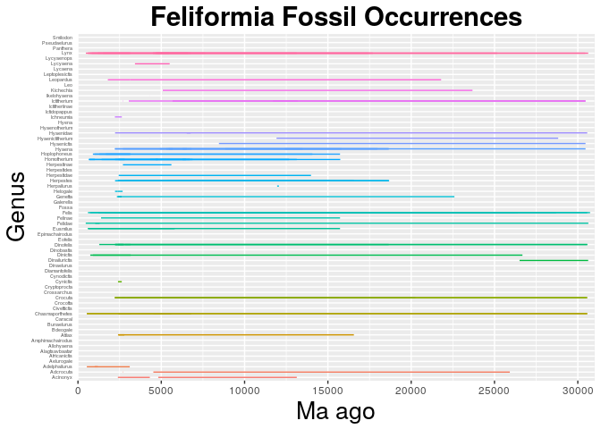

    library(ggplot2)

    setwd("/home/eeb177-student/Desktop/eeb-177/eeb-174-final-project/")

    feliformia <- read.csv("feliformia-ranges.csv", header =F, as.is = T)

    names(feliformia) <- c("genus", "species", "minage", "maxage")
    head(feliformia)

    ##      genus                  species minage maxage
    ## 1 Acinonyx   Acinonyx_?_pardinensis  10647  10647
    ## 2 Acinonyx           Acinonyx_?_sp.   9372   9372
    ## 3 Acinonyx           Acinonyx_aicha   5595   5595
    ## 4 Acinonyx Acinonyx_cf._pardinensis   9043   9043
    ## 5 Acinonyx         Acinonyx_jubatus   4792   8626
    ## 6 Acinonyx     Acinonyx_pardinensis   9643  26265

    feliformia_occ <- ggplot(feliformia, aes( species, ymin = maxage, ymax=minage, colour = genus))
    feliformia_occ <- feliformia_occ + geom_linerange()
    feliformia_occ <- feliformia_occ + theme(legend.position="none") #removes legend
    feliformia_occ <- feliformia_occ + coord_flip() #flips axis/graph
    feliformia_occ <- feliformia_occ +  theme(axis.text.y = element_text(size=4)) #larger text size
    feliformia_occ <- feliformia_occ + theme(axis.ticks.y=element_blank()) #removes tick marks
    feliformia_occ <- feliformia_occ + scale_y_continuous(limits=c(0, 40), expand = c(0, 0), breaks=c(0, 10, 20, 30, 40)) #removes white space on graphs
    feliformia_occ <- feliformia_occ + labs(title = "Feliformia Fossil Occurrences", x = "Species", y = "Ma ago") + theme(plot.title = element_text(hjust = 0.5, size=22, face = "bold"), axis.title =element_text(size=20))  #adds title/labels
    feliformia_occ

    ## Warning: Removed 686 rows containing missing values (geom_linerange).

